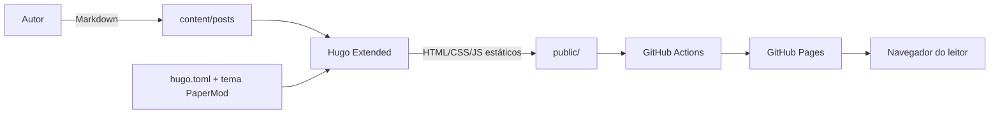

# oalvaroaqui — blog pessoal

Blog pessoal gerado com Hugo e tema PaperMod. Repositório organizado para escrita de posts em Markdown, build estático e publicação no GitHub Pages via GitHub Actions.

## Tecnologias

- Hugo (gerador de site estático)
- Tema PaperMod (tema Hugo)
- GitHub Actions (pipeline de build e deploy)
- GitHub Pages (hosting)
- Markdown (conteúdo dos posts)

## Estrutura do projeto

- `content/posts/`: artigos em Markdown
- `layouts/`: overrides de templates (quando necessário)
- `static/`: arquivos estáticos (imagens, favicons etc.)
- `assets/`: assets processados pelo Hugo
- `hugo.toml`: configuração principal do site
- `themes/PaperMod/`: tema utilizado
- `public/`: saída gerada do build (site estático)

## Configuração de ambiente

Pré-requisitos:

- Hugo Extended instalado
- Git

Verifique a instalação do Hugo:

```bash
hugo version
```

Se precisar instalar:

- Linux/macOS: siga a documentação oficial do Hugo
- Windows: use `choco install hugo-extended` ou `scoop install hugo-extended`

## Instalação e uso local

1) Clone o repositório (inclui o tema já versionado dentro de `themes/`)
2) Suba o servidor local:

```bash
hugo server -D
```

3) Acesse no navegador:

```
http://localhost:1313
```

Para gerar o site estático:

```bash
hugo --minify --gc
```

A saída ficará em `public/`.

## Como criar um novo post

```bash
hugo new posts/meu-post.md
```

Edite o arquivo em `content/posts/` e use front matter compatível com o Hugo.

## Deploy

O deploy é feito via GitHub Actions e GitHub Pages:

- Workflow: `themes/PaperMod/.github/workflows/gh-pages.yml`
- Ao fazer push na branch `main`, o workflow gera o site e publica no GitHub Pages.

## Diagrama de arquitetura



## Notas

- A URL base do site está definida em `hugo.toml`.
- O tema PaperMod já está dentro do repositório em `themes/PaperMod/`.
